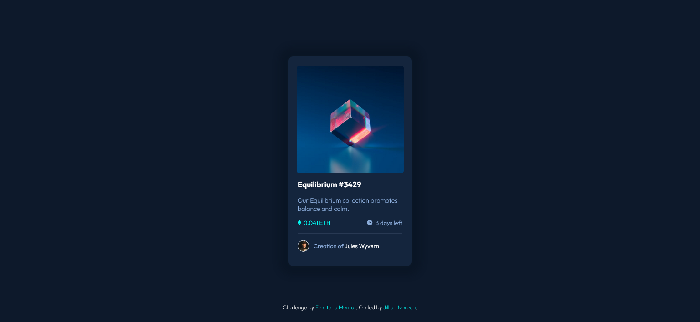

# Frontend Mentor - NFT preview card component solution

This is a solution to the [NFT preview card component challenge on Frontend Mentor](https://www.frontendmentor.io/challenges/nft-preview-card-component-SbdUL_w0U). Frontend Mentor challenges help you improve your coding skills by building realistic projects. 

## Table of contents

- [Overview](#overview)
  - [The challenge](#the-challenge)
  - [Screenshot](#screenshot)
  - [Links](#links)
- [My process](#my-process)
  - [Built with](#built-with)
  - [What I learned](#what-i-learned)
  - [Useful resources](#useful-resources)
- [Author](#author)


## Overview

### The challenge

Users should be able to:

- View the optimal layout depending on their device's screen size
- See hover states for interactive elements

### Screenshot



### Links

- Solution URL: [https://github.com/jilliannoreen/nft-preview-card-component](https://github.com/jilliannoreen/nft-preview-card-component)
- Live Site URL: [https://jilliannoreen.github.io/nft-preview-card-component/](https://jilliannoreen.github.io/nft-preview-card-component/)

## My process

### Built with

- HTML5 
- CSS

### What I learned

- CSS hsla() Function
```css
.overlay {
  background-color: hsla(178, 100%, 50%, 0.6);
}
```
- CSS Variables
```css
:root{
    /*Primary*/
    --soft-blue: hsl(215, 51%, 70%);
    --cyan: hsl(178, 100%, 50%);
    /*Neutral*/
    --very-dark-blue-main-bg: hsl(217, 54%, 11%);
    --very-dark-blue-card-bg: hsl(216, 50%, 16%);
    --very-dark-blue-line: hsl(215, 32%, 27%);
    --white: hsl(0, 0%, 100%);
}
```
- CSS Overlay Effect
```css
.overlay{
    position: absolute;
    width: 235px;
    height: 235px;
    border-radius: 5px;
    display: flex;
    align-items: center;
    justify-content: center;
    background-color: var(--cyan);
    opacity: 0;
    transition: ease .8s;
}

.nft-image:hover .overlay{
    cursor: pointer;
    background-color: hsla(178, 100%, 50%, 0.6);
    opacity: 1;
    
}

.overlay img{
    width: 40px;
    height: 40px;
    color:var(--white);
}
```

### Useful resources

- [CSS overlay](https://www.javatpoint.com/css-overlay)


## Author
- GitHub - [@jilliannoreen](https://github.com/jilliannoreen)
- Frontend Mentor - [@jilliannoreen](https://www.frontendmentor.io/profile/jilliannoreen)


